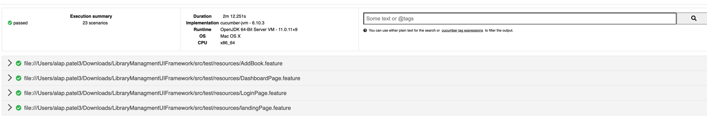
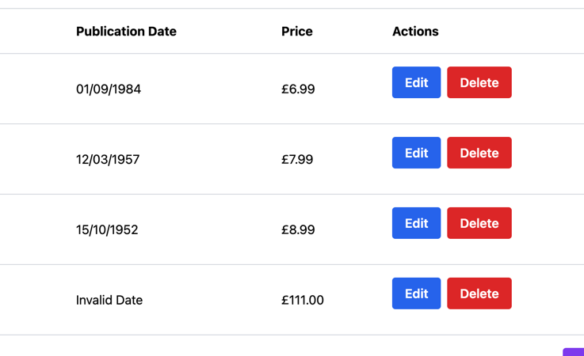

Project Structure:
1)src/test/resources/DataConfig - having config file containing url and data json file. (Changing json file to txt file in order to send for review , while running the project change the file name to 
2)src/test/java/steps - Step defination file
3)src/test/java/runner - having cucumber test runner file
4)src/test/java/pages - having page objects file containing all elements
5)src/test/java/utils - got cofig reader,json reader and webdriver manager classes
6)pom.xml manages all dependencies 
7)Target folder has got cucumber report

============================
To run the project:
mvn clean test / run from individual feature/scenarios / run from test runner file.
============================

Defects:
1)Log out functionality is not working  (User remain on catalogue page)
2)date field validation missing - allowing entering any random strings and which gives invalid value on catalogue.

3)There is not length validation for fields except title on add book on screen!
